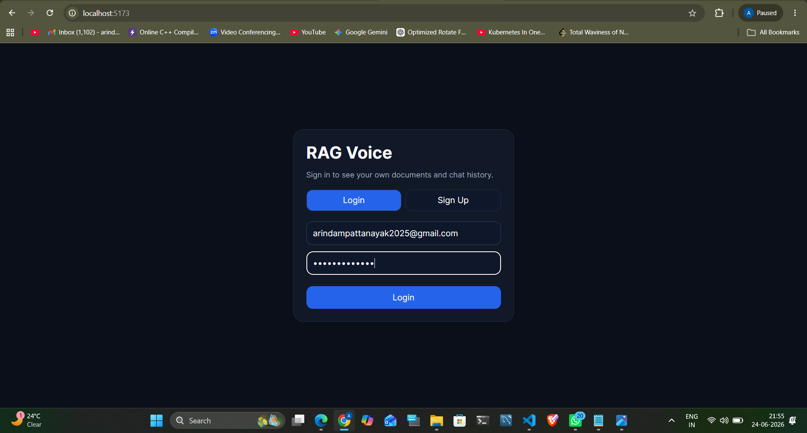
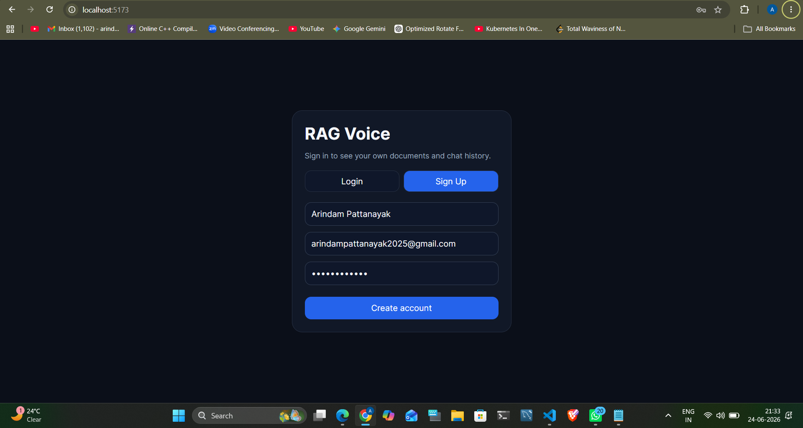
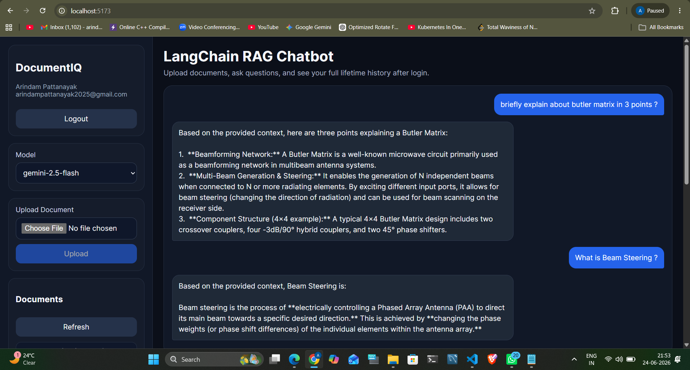
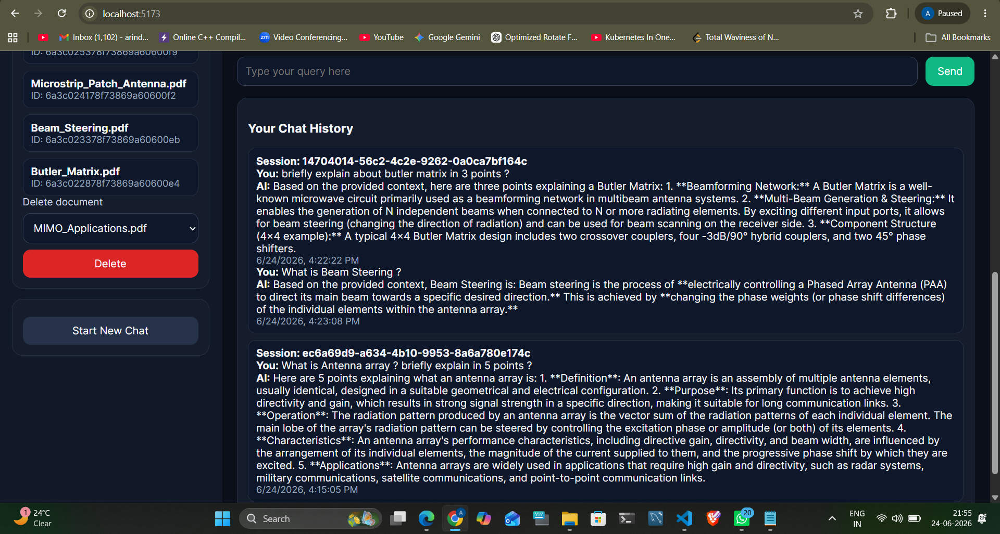

# **DocumentIQ-RAG-Chatbot** 

## **Overview** 

DocumentIQ-RAG-Chatbot is an AI-powered Retrieval-Augmented Generation (RAG) application that enables users to upload documents, build a searchable knowledge base, and interact with their documents through natural language conversations. 

The application combines semantic document retrieval using ChromaDB with Google's Gemini 2.5 Flash model to generate accurate, context-aware responses. Users can upload PDF, DOCX, and HTML files, which are automatically processed, embedded, and indexed for efficient information retrieval. 

## **Features** 

-  Upload and process PDF, DOCX, and HTML documents 

-  Semantic search using vector embeddings 

-  Context-aware responses powered by Gemini 2.5 Flash 

-  Retrieval-Augmented Generation (RAG) pipeline using LangChain 

-  Persistent chat history stored in MongoDB 

-  Document indexing and management 

-  FastAPI backend for high-performance API handling 

-  Modern React-based user interface 

-  Delete and manage uploaded documents 

-  Configurable retrieval and generation parameters

## Demo

### Login Page


### Signup Page


### AI Response


### Chat History


##  Tech Stack

| Category | Technology | Purpose |
| :--- | :--- | :--- |
| **Frontend** | React.js | Provides a modern and responsive user interface for document management and chatbot interactions. |
| **Backend** | FastAPI | Handles API requests, authentication, document processing, and communication with the RAG pipeline. |
| **Database** | MongoDB Atlas | Stores user accounts, authentication data, chat history, session information, and document metadata. |
| **Vector Store** | ChromaDB | Stores document embeddings and performs semantic similarity searches for relevant context retrieval. |
| **LLM** | Gemini 2.5 Flash | Generates intelligent, context-aware responses using retrieved document information. |
| **Embedding Model** | all-MiniLM-L6-v2 | Converts document text into dense vector embeddings for semantic search and retrieval. |
| **Framework** | LangChain | Orchestrates document loading, chunking, retrieval, prompt engineering, and LLM interactions. |
| **Document Loaders** | PyPDFLoader, Docx2txtLoader, UnstructuredHTMLLoader | Extracts text and processes content from PDF, DOCX, and HTML files. |
| **Text Splitter** | RecursiveCharacterTextSplitter | Splits large documents into manageable chunks while preserving contextual information. |
| **Language** | Python 3.11.11 | Core programming language used for backend development and AI integration. |

## **How It Works** 

1. User uploads a document. 

2. LangChain loads and extracts text from the document. 

3. The document is split into smaller chunks. 

4. Chunks are converted into embeddings using all-MiniLM-L6-v2. 

5. Embeddings are stored in ChromaDB. 

6. User submits a query through the chat interface. 

7. Relevant document chunks are retrieved using semantic search. 

8. Retrieved context is passed to Gemini 2.5 Flash. 

9. The model generates a context-aware response. 

10. Chat history and metadata are stored in MongoDB. 

## **Prerequisites** 

Before running the application, ensure you have: 

- Python 3.11.11 

- Node.js and npm 

- MongoDB (Local or MongoDB Atlas) 

- Google Gemini API Key 

## **Environment Variables** 

Create a .env file inside the **backend** directory and add the following: 

DB_URI=your_mongodb_connection_string 

DB_NAME=your_database_name 

GEMINI_API_KEY=your_gemini_api_key 

GEMINI_MODEL=gemini-2.5-flash

RETRIEVER_K=5 

LLM_TEMPERATURE=0.7

FRONTEND_URL=http://localhost:5173 

SECRET_KEY=your_secret_key

ALGORITHM=HS256

ACCESS_TOKEN_EXPIRE_MINUTES=1440
 
## **Installation** 

## **1️) Clone the Repository** 
```bash
git clone <repository-url> 
```
```bash
cd DocumentIQ-RAG-Chatbot 
```
## **2) Create a Virtual Environment** 
```bash
python -m venv venv 
```
## **3️) Activate the Virtual Environment** 

### **Linux / macOS** 
```bash
source venv/bin/activate 
```
### **Windows** 
```bash
venv\Scripts\activate 
```
## **4️) Install Backend Dependencies** 
```bash
pip install -r requirements.txt 
```
## **5) Install Frontend Dependencies** 
```bash
npm install 
```
## **6) Running the Application** 

## **Start the Backend** 

Open a terminal: 
```bash
cd backend
``` 
```bash
uvicorn src.main:app --reload 
```

Backend URL: http://localhost:8000 

## **Start the Frontend** 

Open a new terminal:
```bash
cd frontend
``` 
```bash
npm run dev 
```

Frontend URL: http://localhost:5173 


## **Example Use Cases** 

- Research Paper Question Answering 

- Company Knowledge Base Assistant 

- Legal Document Exploration 

- Academic Study Assistant 

- Technical Documentation Search 

- Internal Enterprise Knowledge Management 


## **Author** 

## **Arindam Pattanayak** 


